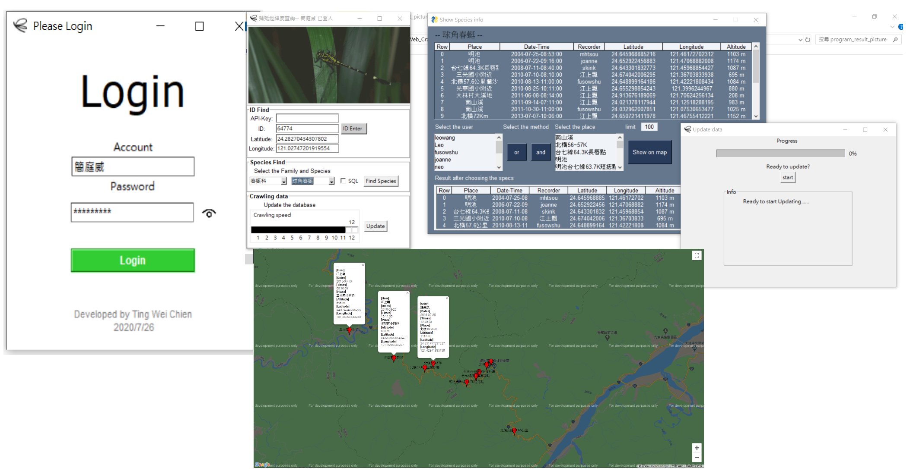
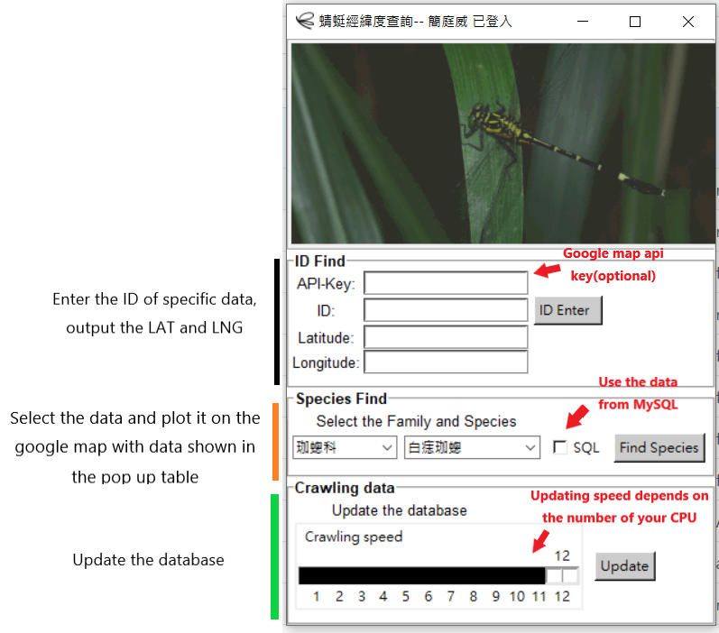
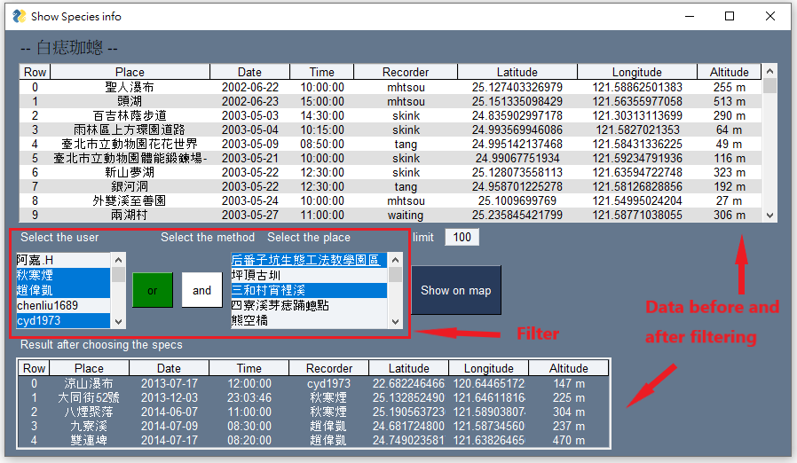
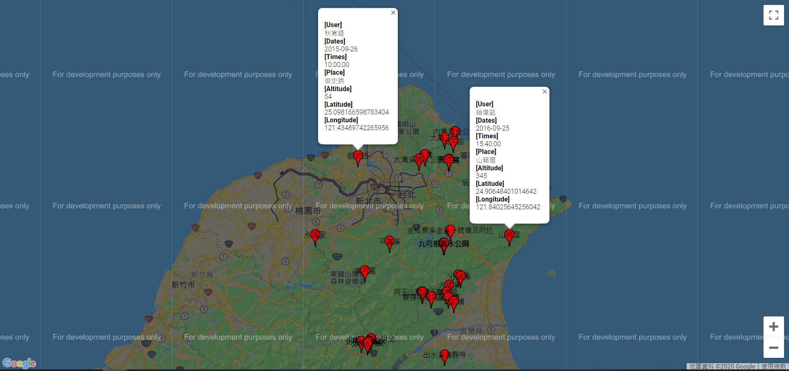
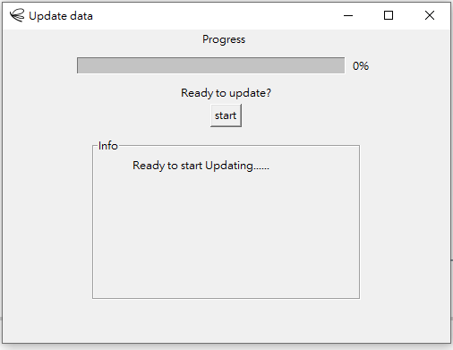

  
  
  
  

<h1 align="center">Dragonfly Web Crawler</h1>

    <em>Python 3.7.3</em>

    
     
    

## 1. Introduce

- Crawl the data from recording system, doing data processing and save it to the MySQL
- Print the data into google map
- Develop the GUI by ***Tkinter*** and ***PySimpleGUI***
- Plot the charts by ***matplotlib*** and ***pyecharts***

---

## 2. Include Library

- Web Crawler:
  - **requests**
  - **bs4 (BeautifulSoup)**
  - **selenium (webdriver)**

- Data Processing
  - **re**
  - **numpy**

- GUI
  - **Tkinter**
  - **PySimpleGui**
  - **webbrowser**

- Data Saving
  - **csv**
  - **json**
  - **multiprocessing**
  - **mysqul.connector**

- Charts Plotting
  - **matplotlib**
  - **pyecharts**

- Executable file
  - **pyinstaller**

---

## 3. Function

---

## 4. Demonstration

#### (1) ***Overview***

#### (2) ***Login***

#### (3) ***Mainpage***

#### (4) ***Plot to Google map***

#### (5) ***Save the data***

#### (6) ***Plot by matplotlib***

- **Tree plot for species relationship**
    
- **(Bar and Line plot) Species apperance among different month and year**
    
- **(Pie plot) Species apperance among different month and year**
    

#### (7) ***Plot by pyecharts***

- **Combine the map, worldcloud, bar, pie, table together**
   

---

## 5. License

- **[MIT license](http://opensource.org/licenses/mit-license.php)**
- Copyright 2020 © <a href="https://github.com/tingweichien" target="_blank">Ting Wei Chien</a>.
