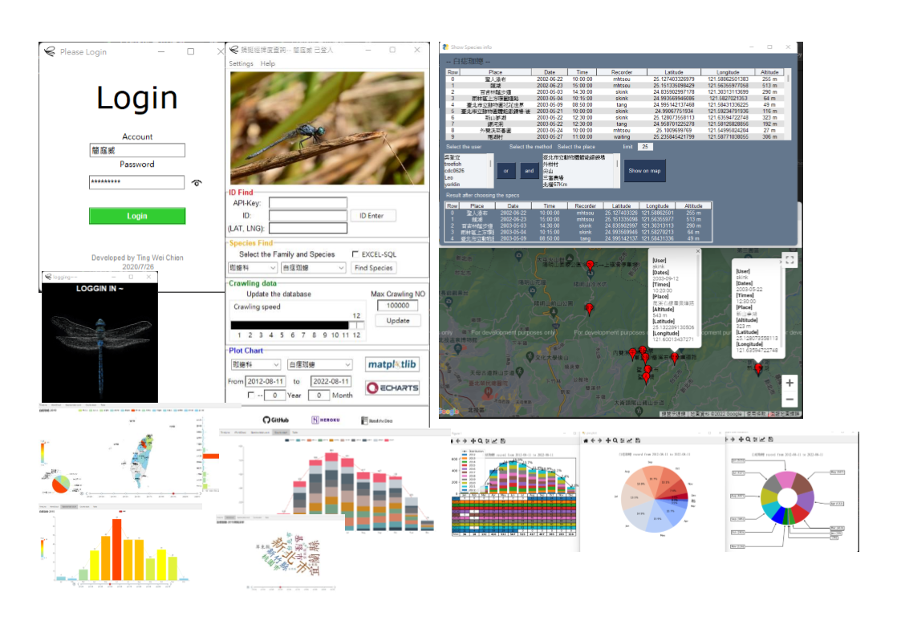
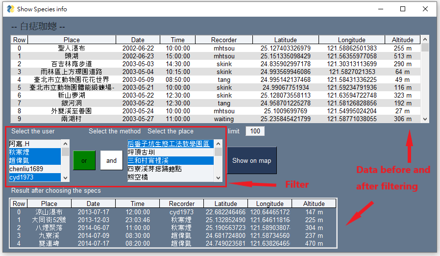
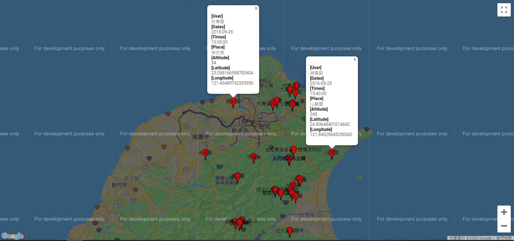

<p align="center">
  <a data-flickr-embed="true" href="https://www.flickr.com/photos/129776788@N07/28181453671/" title="聯紋春蜓Gomphidia confluens Selys, 1878"></a>


</p>

</p>
<h1 align="center">Dragonfly Web Crawler</h1>
<p align="center">
    <em>Python 3.7.3</em>
</p>

<p align="center">
    <a href="https://ci.appveyor.com/project/tingweichien/dragonfly-web-crawler">
        
    </a>
     <a href="https://github.com/pyecharts/pyecharts/pulls">
        
    </a>
    <a href='https://dragonfly-web-crawler.readthedocs.io/en/latest/?badge=latest'>
        
    </a>
    <a href="https://opensource.org/licenses/MIT">
        
    </a>
</p>


## 1. Introduce

- Crawl the data from recording system, doing data processing and save it to the MySQL database.
- Print the data on google map.
- Develop the GUI by ***Tkinter*** and ***PySimpleGUI***.
- Plot the charts by ***matplotlib*** and ***pyecharts***.

---

## 2. Installation

- Execute the ```Dragonfly-Data.exe``` to run the program.


- Open ```Dragonfly-Data-debug.py``` or ```.\src\GUI_split.py``` debug it.

---

## 3. Include Library

- Web Crawler:
  - **requests**
  - **bs4 (BeautifulSoup)**
  - **selenium (webdriver)**

- Data Processing
  - **re**
  - **numpy**

- GUI
  - **Tkinter**
  - **PySimpleGui**
  - **webbrowser**

- Data Saving
  - **csv**
  - **json**
  - **multiprocessing**
  - **mysqul.connector**

- Charts Plotting
  - **matplotlib**
  - **pyecharts**

- Executable file
  - **pyinstaller**

---

## 4. File function

|File|Function|
|--|--|
|GUI_split.exe |The executive file for the program|
|GUI_split.py|The main GUI file|
|GUI_split.spec|File specify for pyinstaller|
|Dragonfly.py|For web crawler|
|DataClass.py|The class declaration for the data|
|Database.py|Write or read from the MySQL database|
|Save2File.py|Save(Write) or read the data to or from CSV file|
|Index.py|The file to store variable for setting|
|hook.py <br> .hooks\     |The links for the libraries to hooks to do ptinstaller|
|.Crawl_Data\ <br> .Crawl_Data_clea\ | The data crawl from the web store in csv|
|update_chromdriver.py|Tto update the chromedriver to satisfy with the current chrome version|
---

## 5. Demonstration

#### (1) ***Overview***



#### (2) ***Login***


#### (3) ***Waiting***


#### (4) ***Mainpage***


#### (5) ***Plot to Google map***




#### (6) ***Save the data***


#### (7) ***Plot by matplotlib***

- **Tree plot for species relationship**
    
- **(Bar and Line plot) Species apperance among different month and year**
    
- **(Pie plot) Species apperance among different month and year**
    

#### (8) ***Plot by pyecharts***
- **Overview**
  

- **Combine the map, worldcloud, bar, pie, table together**
  

---

## 5. License

[](http://badges.mit-license.org)

- **[MIT license](http://opensource.org/licenses/mit-license.php)**
- Copyright 2020 © <a href="https://github.com/tingweichien" target="_blank">Ting Wei Chien</a>.
